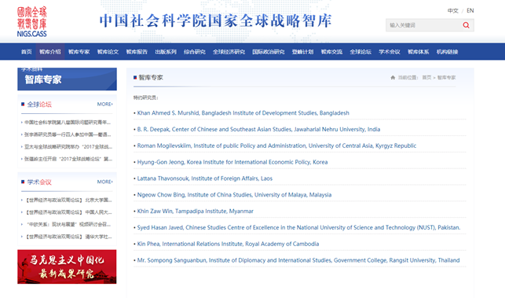

##### 什么是智库：

##### 		智库是对政治、商业或军事政策进行调查、分析研究与研发策略，并致力于将学术研究与策略影响落实为政府政策的机构。（维基百科）

##### 		关于对智库的理解，我觉得智库是一个非常复杂的结合体。首先以中国社会科学院国家全球战略智库为例，该智库是中国政府2015年底确定的25家高端智库试点单位之一，属于试点单位中国际政治类专业高端智库，实体依托单位为世界经济与政治研究所。其功能总结下来就是以马列毛等指导思想，以及整合中国社科院国际问题领域研究力量，对当前中国治理观以及政治经济理论上的深度探索，提供研究和咨询，开展前沿性、针对性、储备性全球战略研究。（中国社会科学院国家全球战略智库）

##### 		下面是其官网搜索栏的图。如果说，智库的数据来源是由那些专家决策产生，那么产生的这些数据就必须得到高效率的存储与搜索。

##### 		对于下面的这张图，在一个智库中，会产生包括在智库中决策的专家，还有通过决策产生的一些文件比如智库论文，智库报告等。对于智库专家而言，因为网站上放出的是特约研究员，数量比较少，但是如果将参与这个智库的人全放上去，数据量会很大，那么就会需要进行数据的查找。比如该网站的智库论文这一个板块，有62篇论文，如果想去自己找的话，很难找到，并且随着之后的发展，论文只会越来越多。而刚刚试了一下该网站的搜索功能，就是下图的右上角的搜索框，现在还不能实现搜索的功能。也就是点了没反应。

##### 		所以在这方面，还是有空缺可以填补的。

##### 关于行业智库，其实是智库的分类。目前智库可以分为四大类：

- ###### 学术智库

- ###### 专案智库

- ###### 游说倡议智库

- ###### 政党智库

##### 上面谈到的是应该是政党智库。关于搜索功能在智库中的应用，上述的调研表明了中国社会科学院国家全球战略智库这个系统中没有搜索功能，而这个搜索功能是对应于该智库的产出数据的，包括一些文件等，随着之后智库的不断扩充，文件越来越多，所以在这方面还是有很大的发展空间。
